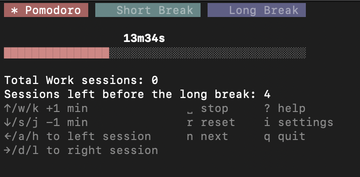

# 🍅 Pomogoro


## Description

**Pomogoro** is a terminal-based Pomodoro timer application written in Go. It’s designed to help you stay focused by managing work and break sessions efficiently.



## Installation and usage

You should have Go installed

### 1. Install or update

```
go install github.com/borissimkin/pomogoro@latest
```

### 2. Run

```
pomogoro
```

## Features

- **Sound and Push Notifications**: Receive audio and push notifications when each session ends.
- **Fully Customizable Pomodoro Settings**:
    - Set custom durations for each type of session (work, short break, long break)
    - Enable or disable notifications
    - Auto-start the next session if desired
- **Flexible Time Adjustment**: Modify session durations on-the-fly to suit your needs.


## Technologies

Pomogoro is built in Go, utilizing the [Bubbletea](https://github.com/charmbracelet/bubbletea) library for a streamlined and interactive command-line
